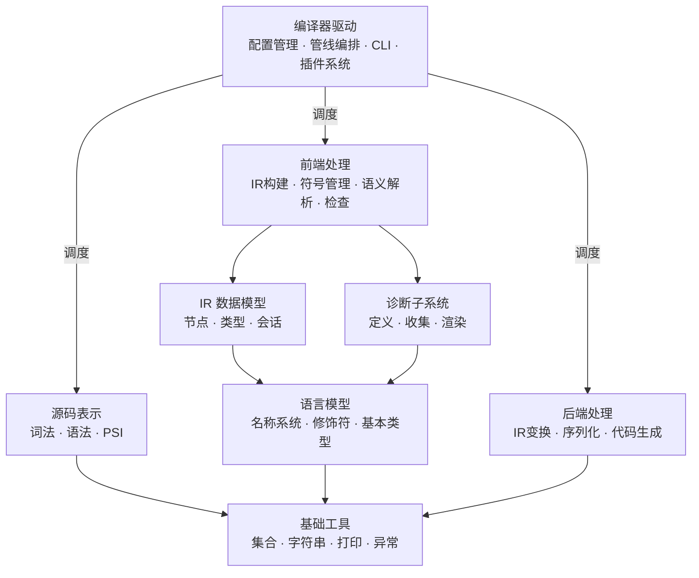
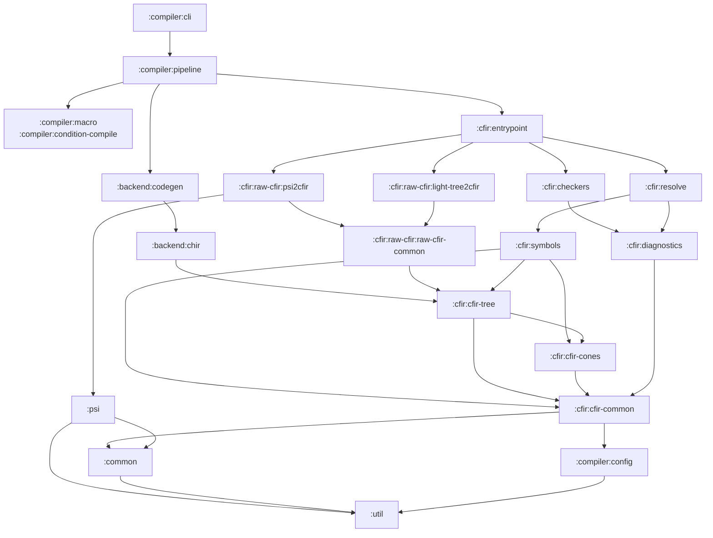

# 编译器模块组织设计（基于子系统划分）

> 从编译器子系统划分出发，基于 12 阶段编译管线和数据流方向，规划仓颉编译器的模块组织。
> 不以当前代码量为依据，以职责边界和依赖方向为准则。
> 保留仓库现有模块名，优先修正边界与依赖，不做大规模重命名。

---

## 设计原则

1. **按子系统划分**：模块对应编译器子系统，而非按文件数量或开发阶段划分
2. **数据定义与处理分离**：IR 数据模型（是什么）与处理逻辑（做什么）分属不同模块
3. **子系统依赖单向**：总体保持 `基础 → 数据模型 → 处理逻辑 → 编排入口`；具体实现依赖以最小闭包为准，不把可替换实现细节上升为顶层公理
4. **诊断作为独立子系统**：诊断框架被多个处理阶段共享，必须独立于任何特定阶段
5. **按需创建**：未实现模块在实际开发时再加入构建，不为“未来可能用到”预先制造空壳
6. **保持现有模块名**：优先通过移动职责、收窄依赖、补齐接口边界来演进结构，而不是用大规模重命名制造额外扰动

---

## 编译器子系统总览



每个子系统对应一组 Gradle 模块。以下按依赖层级自底向上说明。

---

## 第一层：基础工具

与编译器语义无关的纯工具，任何模块均可依赖。

| 模块 | 职责 | 依赖 |
|---|---|---|
| `:util` | 集合扩展、字符串工具、Printer、异常基类 | 无 |

**边界原则：** 此模块不涉及任何仓颉语言概念。判断标准是：若把它复制到另一个编译器项目中，无需修改任何业务语义代码，则属于此模块。

---

## 第二层：语言模型

定义仓颉语言的基础词汇，即多个阶段共享的通用抽象。

| 模块 | 职责 | 依赖 |
|---|---|---|
| `:common` | 名称系统（Name、FqName、ClassId、CallableId）、修饰符（Modality、Visibility）、基本类型枚举（PrimitiveType）、标准名称常量 | `:util` |

**边界原则：** 这里只放**语言层面**的概念定义，不放编译器执行逻辑。

---

## 第三层：编译器配置

编译器运行期配置，独立于具体编译逻辑。

| 模块 | 职责 | 依赖 |
|---|---|---|
| `:compiler:config` | 语言版本设置（LanguageVersionSettings）、编译消息类型（Severity/Location）、编译选项 | `:util` |

**边界原则：** 只描述编译器如何运行，不承载任何前端或后端处理实现。

---

## 第四层：CFIR 数据模型

编译器的核心数据结构。所有前端处理和后端处理都围绕这些数据模型展开。

### 4.1 会话与通用 CFIR 基础

| 模块 | 职责 | 依赖 |
|---|---|---|
| `:cfir:cfir-common` | CfirSession、CfirSessionComponent、CfirModuleData、SourceElement 抽象，以及其他多个 CFIR 子系统共享的会话/基础设施 | `:common`, `:compiler:config`, `:util` |

编译会话是所有 CFIR 子系统的上下文容器。一次编译对应一个 Session，各阶段的处理器和服务通过 Session 获取依赖。

**补充约束：**
- 当前仓库中的 `CjSourceElement`、PSI/LightTree 源码元素桥接实现也位于该模块。
- 若后续按需拆出 `:compiler:frontend.common`，它应作为**前端桥接模块**存在，承载 IntelliJ/LightTree 相关源码元素实现，而不是因为文件数少再并回会话核心。

### 4.2 类型系统

| 模块 | 职责 | 依赖 |
|---|---|---|
| `:cfir:cfir-cones` | ConeCangJieType 层级（ClassLikeType、FuncType、TupleType、TypeParameterType、IntersectionType、ErrorType...）、类型投影（ConeTypeProjection）、类型属性（ConeAttributes）、标准库类型 ID | `:cfir:cfir-common`, `:common` |

类型系统定义仓颉的全部类型形态。此模块**只定义类型是什么**，不做类型推断、子类型判断等计算。

### 4.3 IR 节点树

| 模块 | 职责 | 依赖 |
|---|---|---|
| `:cfir:cfir-tree` | IR 节点定义（声明、表达式、类型引用、模式匹配、引用）、访问者模式（Visitor、Transformer、DefaultVisitor） | `:cfir:cfir-common`, `:cfir:cfir-cones`, `:common`, `:util` |
| `:cfir:cfir-tree:tree-generator` | cfir-tree 的代码生成器（构建时工具） | — |

这是编译器的**中心数据结构**。一个仓颉程序在编译器内部的完整表示就是一棵 CFIR 树。

---

## 第五层：诊断子系统

贯穿多个编译阶段的横切关注点，应独立于任何特定处理阶段。

| 模块 | 职责 | 依赖 |
|---|---|---|
| `:cfir:diagnostics` | 诊断框架核心：DiagnosticFactory、DiagnosticReporter、Severity、DiagnosticsCollector、PositioningStrategy 等 | `:cfir:cfir-common` |
| `:cfir:diagnostic-renderers` | 诊断渲染：将诊断对象格式化为人类可读的错误/警告消息 | `:cfir:diagnostics` |

**为什么要拆出：**
- IR 构建阶段需要报告语法级错误
- resolve 阶段需要报告类型与绑定错误
- checkers 阶段需要报告语义规则错误
- CLI 与 IDE 都需要统一渲染诊断输出

当前仓库里诊断核心仍有一部分位于 `:cfir:cfir-common` 一侧；目标边界应是将其抽离为 `:cfir:diagnostics`，而不是继续把诊断框架绑定在会话核心中。

---

## 第六层：源码表示

将源码文本转换为结构化树，并为 IDE 与前端处理提供统一语法入口。

| 模块 | 职责 | 依赖 |
|---|---|---|
| `:psi` | 词法分析（JFlex Lexer）、语法分析（Parser）、PSI 节点定义（CjFile、CjClass、CjFunction...）、Token 类型 | `:common`, `:util` |

PSI 与 CFIR 是两棵不同用途的树：PSI 是源码语法镜像，CFIR 是语义模型。两者通过 IR 构建模块桥接。

---

## 第七层：前端处理

将源码转换为完整语义 IR 的全部处理逻辑。

### 7.1 IR 构建（阶段 6 CFIR_BUILD）

将 PSI / LightTree 翻译为 Raw CFIR 骨架。

| 模块 | 职责 | 依赖 |
|---|---|---|
| `:cfir:raw-cfir:raw-cfir-common` | 共享基类：`AbstractRawCfirBuilder<T>`、转换工具函数、与具体前端输入无关的构建基础 | `:cfir:cfir-tree` |
| `:cfir:raw-cfir:psi2cfir` | PSI → Raw CFIR 转换的完整实现 | `:cfir:raw-cfir:raw-cfir-common`, `:psi` |
| `:cfir:raw-cfir:light-tree2cfir` | LightTree → Raw CFIR 转换（高性能路径，跳过完整 PSI 构建） | `:cfir:raw-cfir:raw-cfir-common` |

**关键约束：**
- `:cfir:raw-cfir:raw-cfir-common` 应保持对 `:psi` 无关。
- `AbstractRawCfirBuilder<T>` 是泛型抽象；PSI 专属逻辑只应留在 `:cfir:raw-cfir:psi2cfir`。
- 这样 `:cfir:raw-cfir:light-tree2cfir` 才能共享真正干净的底座，而不是被 PSI 依赖反向污染。

### 7.2 符号管理（阶段 4 + 阶段 7 基础）

编译器查找“这个名字对应什么声明”的机制。

| 模块 | 职责 | 依赖 |
|---|---|---|
| `:cfir:symbols` | 符号提供者接口与实现：BuiltinSymbolProvider、SourceSymbolProvider、CjoSymbolProvider、Scope 管理 | `:cfir:cfir-tree`, `:cfir:cfir-cones`, `:cfir:cfir-common` |

**关键约束：**
- Symbol provider 本身是 Session component。
- 因此 `:cfir:symbols` 的边界必须显式纳入 `:cfir:cfir-common`，而不是只写成 tree + cones。

### 7.3 语义解析（阶段 7 CFIR_RESOLVE 主体）

对 Raw CFIR 执行渐进式语义分析，填充类型信息、绑定符号引用。

| 模块 | 职责 | 依赖 |
|---|---|---|
| `:cfir:resolve` | 多 Phase 解析引擎：IMPORTS → SUPER_TYPES → TYPES → STATUS → EXTENSIONS → IMPLICIT_TYPES → BODY_RESOLVE。包含类型推断、导入解析、重载解析、超类图构建 | `:cfir:cfir-tree`, `:cfir:cfir-cones`, `:cfir:symbols`, `:cfir:diagnostics` |

**硬约束只有两条：**
- resolve **不再依赖** checkers
- checker 的编排职责应从 resolve 中移出

至于 checkers 是否直接依赖 resolve，是实现选择，不应被写成顶层架构公理。

### 7.4 诊断检查（阶段 7 末尾 CHECKERS）

在语义解析完成后，对已理解的 CFIR 执行正确性验证。

| 模块 | 职责 | 依赖 |
|---|---|---|
| `:cfir:checkers` | 声明检查器、表达式检查器、类型检查器、CheckerContext、检查结果收集 | `:cfir:cfir-tree`, `:cfir:diagnostics`, `:cfir:resolve`（按实现需要） |
| `:cfir:checkers:checkers-component-generator` | 检查器组件代码生成（构建时工具） | — |

**边界原则：**
- checkers 与 resolve 职责不同：前者负责“判断是否违规”，后者负责“理解程序语义”。
- 是否让 checkers 直接读取 resolve 结果，取决于实现成本与上下文注入方案，不固定为唯一合法依赖方向。

### 7.5 语义工具（辅助模块）

从 resolve 和 checkers 中提取的纯函数工具集，减少重复。

| 模块 | 职责 | 依赖 |
|---|---|---|
| `:cfir:semantics` | 语义判断纯函数：子类型判断、可见性判断、类型兼容性计算、作用域搜索工具 | `:cfir:cfir-tree`, `:cfir:cfir-cones` |

此模块**不维护状态**，只放可复用的纯函数逻辑。

---

## 第八层：源码变换（前端前置阶段）

在 IR 构建前对源码级结构进行变换，操作对象是 PSI，不涉及 CFIR。

| 模块 | 职责 | 对应阶段 | 依赖 |
|---|---|---|---|
| `:compiler:condition-compile` | 条件编译：根据编译配置裁剪 PSI 分支 | 阶段 3 | `:psi`, `:compiler:config` |
| `:compiler:macro` | 宏展开：收集宏定义 → 解释执行 → 替换 AST | 阶段 5 | `:psi` |

这两个模块按需启用，不要求预先落地。

---

## 第九层：IR 变换（前端后置阶段）

在语义解析完成后，对已完成语义的 CFIR 进行变换。

| 模块 | 职责 | 对应阶段 | 依赖 |
|---|---|---|---|
| `:compiler:finalize` | 语义后脱糖、泛型单态化、溢出策略标注 | 阶段 8 | `:cfir:cfir-tree`, `:cfir:cfir-cones` |
| `:compiler:mangling` | 符号名称修饰：为声明生成全局唯一修饰名 | 阶段 9 | `:cfir:cfir-tree` |

---

## 第十层：序列化

编译产物的持久化与加载。

| 模块 | 职责 | 对应阶段 | 依赖 |
|---|---|---|---|
| `:cfir:serialization` | CFIR → `.cjo` 序列化 | 阶段 10 | `:cfir:cfir-tree` |
| `:cfir:deserialization` | `.cjo` → CFIR 反序列化，为 IMPORT_PACKAGE 阶段提供外部包符号 | 阶段 4 | `:cfir:cfir-tree`, `:cfir:symbols` |

---

## 第十一层：后端

从 CFIR 到目标代码的降级与生成过程。

| 模块 | 职责 | 对应阶段 | 依赖 |
|---|---|---|---|
| `:backend:chir` | CHIR 数据模型（基于 CFG 的高级 IR）+ CFIR → CHIR 转换 + CHIR 级优化 | 阶段 11 | `:cfir:cfir-tree` |
| `:backend:codegen` | CHIR → LLVM IR → `.bc` / `.o` / 可执行文件 | 阶段 12 | `:backend:chir` |

---

## 第十二层：CFIR 编排入口

编排 CFIR 子系统的完整流程，串联构建、解析、检查。

| 模块 | 职责 | 依赖 |
|---|---|---|
| `:cfir:entrypoint` | 默认 CFIR 编排入口：IR 构建 → 符号注册 → 多 Phase 解析 → 检查器编排 | `:cfir:raw-cfir:*`, `:cfir:symbols`, `:cfir:resolve`, `:cfir:checkers` |

**边界原则：**
- 对 CLI / batch 模式来说，`:cfir:entrypoint` 是合理的统一编排入口。
- 对 IDE / Analysis API 来说，更合适的是依赖一个更薄的 frontend facade / bootstrap，而不是把 batch-style entrypoint 固化成“唯一对外入口”。

---

## 第十三层：编译驱动

编排 12 个编译阶段的完整管线，对外暴露编译器入口。

| 模块 | 职责 | 依赖 |
|---|---|---|
| `:compiler:pipeline` | 12 阶段管线编排：定义阶段顺序、阶段间数据传递、错误中断策略 | `:cfir:entrypoint`, 各阶段模块 |
| `:compiler:cli` | 命令行入口：参数解析、环境初始化、管线调用、诊断输出 | `:compiler:pipeline`, `:compiler:config` |
| `:compiler:plugins` | 插件系统：插件加载、MetaTransform 注册、扩展点管理 | `:compiler:config` |

---

## 第十四层：IDE 分析 API

与编译器平行的顶层子系统，为 IntelliJ 插件提供语义查询能力。

| 模块 | 职责 | 依赖 |
|---|---|---|
| `:analysis:analysis-api` | 面向 IDE 的公共分析接口：语义查询、诊断获取、符号导航 | `:psi` |
| `:analysis:analysis-api-impl-base` | 分析 API 基础实现：会话管理、生命周期、权限控制 | `:analysis:analysis-api` |
| `:analysis:analysis-api-cfir` | 基于 CFIR 的分析 API 实现：通过 resolve / CFIR 提供语义信息 | `:analysis:analysis-api-impl-base`, `:cfir:resolve`, `:cfir:cfir-tree` |

**关键约束：**
- `:analysis:analysis-api` 保持 PSI / Session 导向，不直接把 `:cfir:cfir-tree` 作为公共 API 前提。
- CFIR 细节应集中在 `:analysis:analysis-api-cfir`，避免把前端内部数据模型泄露进 IDE 公共接口。

---

## 测试与构建基础设施

| 模块 | 职责 |
|---|---|
| `:tests:test-infrastructure` | 共享测试基础设施：环境搭建、testFixtures、测试数据工具 |
| `:analysis:analysis-test-framework` | 分析 API 测试框架 |
| `:generators` | 构建时代码生成工具 |
| `:dependencies:intellij-core` | IntelliJ Platform 依赖聚合 |

---

## 完整依赖图



说明：图中省略了“按实现需要”的可选依赖，例如 checkers 对 resolve 的直接读取。

---

## 阶段 → 模块映射

| # | 阶段 | 子系统 | 主模块 | 状态 |
|---|---|---|---|---|
| 1 | LOAD_PLUGINS | 驱动 | `:compiler:plugins` | 未实现 |
| 2 | PARSE | 源码表示 | `:psi` | 已实现 |
| 3 | CONDITION_COMPILE | 源码变换 | `:compiler:condition-compile` | 未实现 |
| 4 | IMPORT_PACKAGE | 序列化 + 符号 | `:cfir:deserialization` + `:cfir:symbols` | 未实现 |
| 5 | MACRO_EXPAND | 源码变换 | `:compiler:macro` | 未实现 |
| 6 | CFIR_BUILD | IR 构建 | `:cfir:raw-cfir:psi2cfir` / `:cfir:raw-cfir:light-tree2cfir` | 开发中 |
| 7 | CFIR_RESOLVE | 语义解析 + 检查 | `:cfir:resolve` + `:cfir:checkers` | 开发中 |
| 8 | FINALIZE | IR 变换 | `:compiler:finalize` | 未实现 |
| 9 | MANGLING | IR 变换 | `:compiler:mangling` | 未实现 |
| 10 | SAVE_CJO | 序列化 | `:cfir:serialization` | 未实现 |
| 11 | CFIR2CHIR | 后端 | `:backend:chir` | 未实现 |
| 12 | CODEGEN | 后端 | `:backend:codegen` | 未实现 |

---

## 模块边界判定规则

当不确定某段代码属于哪个模块时，使用以下规则判断：

| 问题 | 如果是 | 归属 |
|---|---|---|
| 它是语言规范里的概念吗？ | 是（Name、Visibility...） | `:common` |
| 它是通用工具函数吗？ | 是 | `:util` |
| 它负责 Session / SessionComponent / ModuleData 吗？ | 是 | `:cfir:cfir-common` |
| 它定义了 CFIR 节点长什么样吗？ | 是（CfirClass、CfirFunction...） | `:cfir:cfir-tree` |
| 它定义了 Cone 类型长什么样吗？ | 是（ConeClassLikeType...） | `:cfir:cfir-cones` |
| 它负责诊断定义、收集、定位吗？ | 是 | `:cfir:diagnostics`（拆出前位于 `:cfir:cfir-common`） |
| 它负责“找到这个名字对应什么”吗？ | 是（SymbolProvider、Scope...） | `:cfir:symbols` |
| 它负责“理解程序语义”吗？ | 是（类型推断、导入解析、重载解析...） | `:cfir:resolve` |
| 它负责“判断程序是否违规”吗？ | 是（检查器...） | `:cfir:checkers` |
| 它是 resolve / checkers 共用的纯函数吗？ | 是 | `:cfir:semantics` |
| 它是 PSI / LightTree 到 SourceElement 的桥接吗？ | 是 | `:compiler:frontend.common`（未拆出前位于 `:cfir:cfir-common`） |
| 它修改的是 PSI 而不是 CFIR 吗？ | 是 | `:compiler:condition-compile` 或 `:compiler:macro` |
| 它把一种 CFIR 变成另一种 CFIR 吗？ | 是 | `:compiler:finalize` 或 `:compiler:mangling` |

---

## settings.gradle.kts 目标形态

下例只列出关键模块，省略 `:compiler`、`:cfir`、`:analysis`、`:tests` 这类容器项目。

```kotlin
// ===== 基础设施 =====
include(":common")
include(":util")
include(":compiler:config")
include(":psi")

// ===== CFIR 数据模型 =====
include(":cfir:cfir-common")
include(":cfir:cfir-cones")
include(":cfir:cfir-tree")
include(":cfir:cfir-tree:tree-generator")

// ===== 诊断子系统（按需拆分） =====
// include(":cfir:diagnostics")
include(":cfir:diagnostic-renderers")

// ===== IR 构建（阶段 6） =====
include(":cfir:raw-cfir:raw-cfir-common")
include(":cfir:raw-cfir:psi2cfir")
include(":cfir:raw-cfir:light-tree2cfir")

// ===== 符号 / 语义 / 检查 =====
// include(":cfir:symbols")
include(":cfir:resolve")
// include(":cfir:semantics")
include(":cfir:checkers")
include(":cfir:checkers:checkers-component-generator")
// include(":cfir:entrypoint")

// ===== 源码变换（按需启用） =====
// include(":compiler:condition-compile")
// include(":compiler:macro")

// ===== IR 变换（按需启用） =====
// include(":compiler:finalize")
// include(":compiler:mangling")

// ===== 序列化（按需启用） =====
// include(":cfir:serialization")
// include(":cfir:deserialization")

// ===== 后端（按需启用） =====
// include(":backend:chir")
// include(":backend:codegen")

// ===== 编译驱动 =====
include(":compiler:cli")
// include(":compiler:pipeline")
// include(":compiler:plugins")

// ===== Analysis API =====
include(":analysis:analysis-api")
include(":analysis:analysis-api-impl-base")
include(":analysis:analysis-api-cfir")

// ===== 测试与构建 =====
include(":tests:test-infrastructure")
include(":analysis:analysis-test-framework")
include(":generators")
include(":dependencies:intellij-core")
```

---

## 与当前结构的对应与调整方向

| 当前模块 | 目标状态 | 调整点 |
|---|---|---|
| `:util` | 保留 | 继续承载基础工具，无需重命名 |
| `:common` | 保留 | 继续承载语言模型，无需重命名 |
| `:compiler:config` | 保留 | 继续承载编译配置 |
| `:psi` | 保留 | 继续承载词法、语法、PSI |
| `:cfir:cfir-common` | 保留并收敛边界 | 会话 / moduleData / source abstraction 留在这里；诊断核心逐步外移；如后续拆出 `:compiler:frontend.common`，只承载前端桥接 |
| `:cfir:cfir-cones` | 保留 | 继续承载类型数据模型 |
| `:cfir:cfir-tree` | 保留 | 继续承载 IR 节点与 visitor |
| `:cfir:cfir-common-psi` | 删除 | 保持为空壳模块不再恢复 |
| `:cfir:raw-cfir:raw-cfir-common` | 保留并清理 | 共享底座去掉 `:psi` 依赖，保持 `AbstractRawCfirBuilder<T>` 泛型化 |
| `:cfir:raw-cfir:psi2cfir` | 保留 | 承载 PSI 专属构建逻辑 |
| `:cfir:raw-cfir:light-tree2cfir` | 保留 | 共享 clean base，不反向引入 PSI |
| `:cfir:resolve` | 保留并解耦 | 移除对 `:cfir:checkers` 的依赖，并把 checker 编排移出 |
| `:cfir:checkers` | 保留 | 是否直接依赖 `:cfir:resolve` 由实现决定，不上升为架构硬规则 |
| `:cfir:diagnostic-renderers` | 保留 | 作为未来诊断子系统的渲染层 |
| `:analysis:analysis-api` | 保留并收窄依赖 | 目标上不直接依赖 `:cfir:cfir-tree`，保持 PSI / Session 导向 |
| `:analysis:analysis-api-impl-base` | 保留 | 承载公共基础实现 |
| `:analysis:analysis-api-cfir` | 保留 | 承接 CFIR 细节依赖与实现 |
| 无（按需创建） | `:cfir:diagnostics` | 从 `:cfir:cfir-common` 抽出诊断核心 |
| 无（按需创建） | `:cfir:symbols` | 从 `:cfir:cfir-tree` 抽出 symbol provider，并显式依赖 `:cfir:cfir-common` |
| 无（按需创建） | `:cfir:semantics` | 提取 resolve / checkers 共享纯函数 |
| 无（按需创建） | `:cfir:entrypoint` | 提供默认编排入口，不宣称唯一外部入口 |
| 无（按需创建） | `:compiler:frontend.common` | 仅在 `CjSourceElement` / PSI-LightTree bridge 继续增长时拆出，不并回会话核心 |
| 无（按需创建） | `:compiler:pipeline` | 12 阶段管线编排 |
