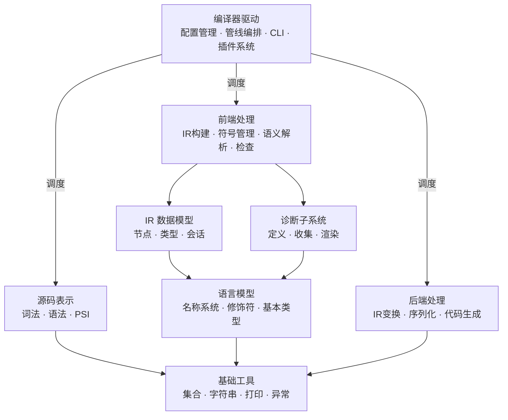
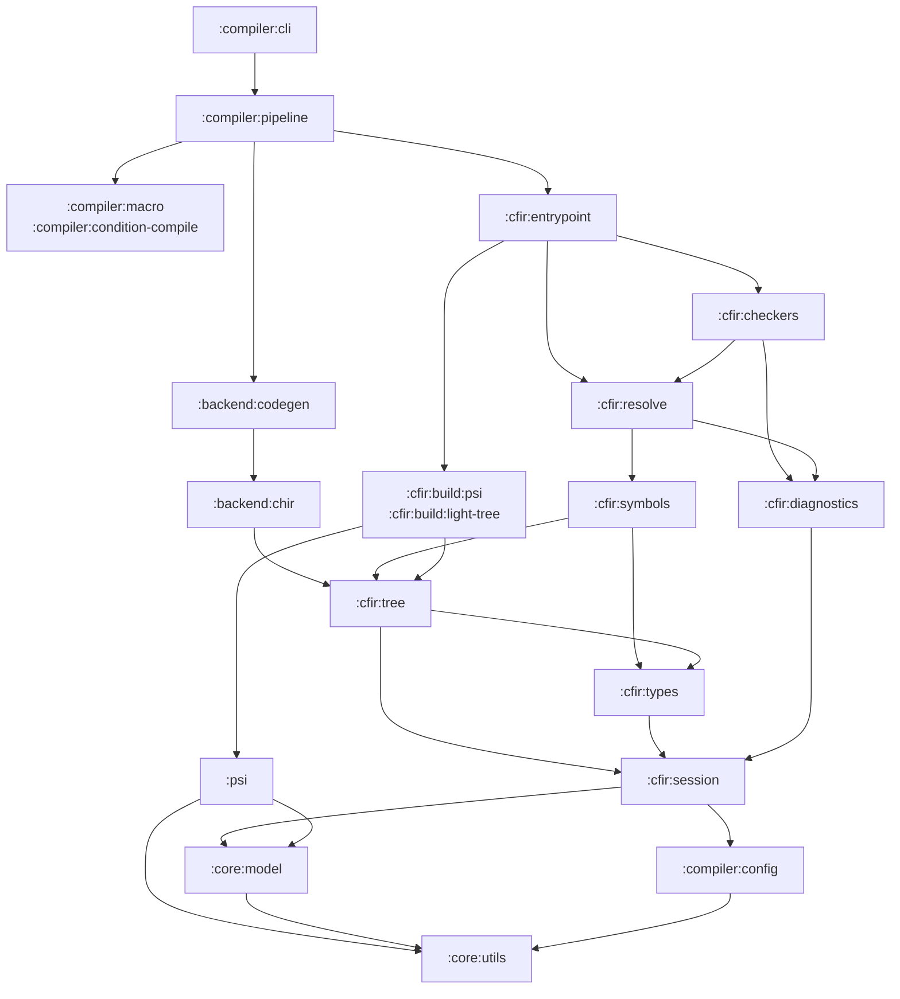

# 编译器模块组织设计（基于子系统划分）

> 从编译器子系统划分出发，基于 12 阶段编译管线和数据流方向，规划仓颉编译器的模块组织。
> 不以当前代码量为依据，以职责边界和依赖方向为准则。

---

## 设计原则

1. **按子系统划分**：模块对应编译器子系统，而非按文件数量或开发阶段划分
2. **数据定义与处理分离**：IR 数据模型（是什么）与处理逻辑（做什么）分属不同模块
3. **依赖严格单向**：`基础 → 数据模型 → 处理逻辑 → 集成入口`，禁止反向或循环
4. **诊断作为独立子系统**：诊断框架被多个处理阶段共享，必须独立于任何特定阶段
5. **按需创建**：未实现的阶段模块在实际开发时再加入构建

---

## 编译器子系统总览



每个子系统对应一组 Gradle 模块。以下按依赖层级自底向上逐一说明。

---

## 第一层：基础工具

与编译器语义无关的纯工具，任何模块均可依赖。

| 模块 | 职责 | 依赖 |
|---|---|---|
| `:core:utils` | 集合扩展、字符串工具、Printer、异常基类 | 无 |

**边界原则：** 此模块不涉及任何仓颉语言概念。判断标准——若将其复制到另一个编译器项目中无需修改任何代码，则属于此模块。

---

## 第二层：语言模型

定义仓颉语言的基础词汇——所有编译阶段共享的通用抽象。

| 模块 | 职责 | 依赖 |
|---|---|---|
| `:core:model` | 名称系统（Name、FqName、ClassId、CallableId）、修饰符（Modality、Visibility）、基本类型枚举（PrimitiveType）、标准名称常量 | `:core:utils` |

**边界原则：** 只包含**语言层面**的概念定义，不涉及编译器行为。问自己：这是语言规范里的概念，还是编译器实现的概念？前者在此，后者在 IR 或驱动中。

---

## 第三层：编译器配置

编译器运行时配置，独立于编译逻辑。

| 模块 | 职责 | 依赖 |
|---|---|---|
| `:compiler:config` | 语言版本设置（LanguageVersionSettings）、编译消息类型（Severity/Location）、编译选项 | `:core:utils` |

**边界原则：** 只描述编译器的"旋钮"——哪些特性开启、什么版本、什么消息格式。不包含任何编译逻辑。

---

## 第四层：中间表示（IR）数据模型

编译器的核心数据结构。所有前端处理和后端处理都围绕这些数据模型展开。

### 4.1 编译会话

| 模块 | 职责 | 依赖 |
|---|---|---|
| `:cfir:session` | CfirSession（编译会话容器）、CfirSessionComponent（组件注册机制）、CfirModuleData（模块元数据）、SourceElement（源码位置抽象） | `:core:model`, `:compiler:config`, `:core:utils` |

编译会话是所有 CFIR 子系统的上下文容器。一次编译对应一个 Session，各阶段的处理器和服务通过 Session 获取依赖。

### 4.2 类型系统

| 模块 | 职责 | 依赖 |
|---|---|---|
| `:cfir:types` | ConeCangJieType 层级（ClassLikeType、FuncType、TupleType、TypeParameterType、IntersectionType、ErrorType...）、类型投影（ConeTypeProjection）、类型属性（ConeAttributes）、标准库类型 ID | `:cfir:session`, `:core:model` |

类型系统定义仓颉的全部类型形态。此模块**只定义类型是什么**，不做类型推断、子类型判断等计算——那些属于语义解析。

### 4.3 IR 节点树

| 模块 | 职责 | 依赖 |
|---|---|---|
| `:cfir:tree` | IR 节点定义（声明、表达式、类型引用、模式匹配、引用）、访问者模式（Visitor、Transformer、DefaultVisitor） | `:cfir:session`, `:cfir:types`, `:core:model`, `:core:utils` |
| `:cfir:tree:generator` | cfir:tree 的代码生成器（构建时工具） | — |

这是编译器的**中心数据结构**。一个仓颉程序在编译器内部的完整表示就是一棵 CFIR 树。

---

## 第五层：诊断子系统

贯穿多个编译阶段的横切关注点，必须独立于任何特定阶段。

| 模块 | 职责 | 依赖 |
|---|---|---|
| `:cfir:diagnostics` | 诊断框架核心：DiagnosticFactory（诊断定义工厂）、DiagnosticReporter（报告接口）、Severity（严重级别）、DiagnosticsCollector（收集与去重）、PositioningStrategy（源码定位） | `:cfir:session` |
| `:cfir:diagnostics:renderers` | 诊断渲染：将诊断对象格式化为人类可读的错误/警告消息 | `:cfir:diagnostics` |

**为什么独立：**
- IR 构建阶段需要报告语法级错误
- 语义解析阶段需要报告类型错误、导入冲突
- 诊断检查阶段需要报告逻辑错误
- CLI 需要渲染诊断输出

若诊断框架嵌入任何一个处理模块，其他模块就不得不反向依赖该处理模块。

---

## 第六层：源码表示

将源码文本转换为结构化树，与 CFIR 平行，不互相依赖。

| 模块 | 职责 | 依赖 |
|---|---|---|
| `:psi` | 词法分析（JFlex Lexer）、语法分析（Parser）、PSI 节点定义（CjFile、CjClass、CjFunction...）、Token 类型 | `:core:model`, `:core:utils` |

PSI 和 CFIR 是两棵独立的树。PSI 是**源码的语法镜像**（保留空白、注释、括号），CFIR 是**程序的语义模型**（只保留编译器关心的信息）。两者通过 IR 构建模块桥接。

---

## 第七层：前端处理

将源码转化为完整语义 IR 的全部处理逻辑。

### 7.1 IR 构建（阶段 6 CFIR_BUILD）

将 PSI 语法树翻译为 Raw CFIR 骨架——有结构，无语义。

| 模块 | 职责 | 依赖 |
|---|---|---|
| `:cfir:build:common` | 共享基类：AbstractRawCfirBuilder、转换工具函数 | `:cfir:tree`, `:psi` |
| `:cfir:build:psi` | PSI → Raw CFIR 转换的完整实现 | `:cfir:build:common`, `:psi` |
| `:cfir:build:light-tree` | LightTree → Raw CFIR 转换（高性能路径，跳过完整 PSI 构建） | `:cfir:build:common` |

**为什么拆为两个实现：** PSI 和 LightTree 是两种不同的源码读取方式。PSI 功能完整（IDE 需要），LightTree 更快（纯编译器模式）。共享基类避免重复，具体实现各自独立。

### 7.2 符号管理（阶段 4 + 阶段 7 基础）

编译器查找"这个名字对应什么声明"的机制。

| 模块 | 职责 | 依赖 |
|---|---|---|
| `:cfir:symbols` | 符号提供者接口与实现：BuiltinSymbolProvider（内置类型/函数）、SourceSymbolProvider（源码声明）、CjoSymbolProvider（.cjo 外部包）、作用域（Scope）管理 | `:cfir:tree`, `:cfir:types` |

符号管理是语义解析的前置基础——resolve 通过符号提供者查找声明，而不是自己遍历 IR 树。

### 7.3 语义解析（阶段 7 CFIR_RESOLVE 主体）

对 Raw CFIR 执行渐进式语义分析，填充类型信息、绑定符号引用。

| 模块 | 职责 | 依赖 |
|---|---|---|
| `:cfir:resolve` | 多 Phase 解析引擎：IMPORTS → SUPER_TYPES → TYPES → STATUS → EXTENSIONS → IMPLICIT_TYPES → BODY_RESOLVE。包含类型推断、导入解析、重载解析、超类图构建 | `:cfir:tree`, `:cfir:types`, `:cfir:symbols`, `:cfir:diagnostics` |

**关键约束：** resolve **不依赖** checkers。语义解析是"理解程序"，诊断检查是"判断对错"——两者职责不同，依赖方向必须是 checkers → resolve。

### 7.4 诊断检查（阶段 7 末尾 CHECKERS）

在语义解析完成后，对已理解的 CFIR 执行正确性验证。

| 模块 | 职责 | 依赖 |
|---|---|---|
| `:cfir:checkers` | 声明检查器、表达式检查器、类型检查器、CheckerContext、检查结果收集 | `:cfir:tree`, `:cfir:resolve`, `:cfir:diagnostics` |
| `:cfir:checkers:generator` | 检查器组件代码生成（构建时工具） | — |

**依赖方向：** `checkers → resolve → symbols → tree`，严格单向。

### 7.5 语义工具（辅助模块）

从 resolve 和 checkers 中提取的纯函数工具集，减少两者的代码重复。

| 模块 | 职责 | 依赖 |
|---|---|---|
| `:cfir:semantics` | 语义判断纯函数：子类型判断、可见性判断、类型兼容性计算、作用域搜索工具 | `:cfir:tree`, `:cfir:types` |

当 resolve 和 checkers 都需要同一个语义判断逻辑时，该逻辑属于此模块。此模块**不维护状态**，只提供纯函数。

---

## 第八层：源码变换（前端前置阶段）

在 IR 构建之前对源码级结构进行变换。操作对象是 PSI，不涉及 CFIR。

| 模块 | 职责 | 对应阶段 | 依赖 |
|---|---|---|---|
| `:compiler:condition-compile` | @When 条件编译：根据编译配置裁剪 PSI 分支 | 阶段 3 | `:psi`, `:compiler:config` |
| `:compiler:macro` | 宏展开：收集宏定义 → 解释执行 → 替换 AST | 阶段 5 | `:psi` |

这两个阶段在 CFIR_BUILD 之前执行。它们修改的是 PSI 树，确保进入 IR 构建时源码已经是最终形态。

---

## 第九层：IR 变换（前端后置阶段）

在语义解析完成后，对已完成语义的 CFIR 进行变换。

| 模块 | 职责 | 对应阶段 | 依赖 |
|---|---|---|---|
| `:compiler:finalize` | 语义后脱糖 + 泛型单态化 + 溢出策略标注 | 阶段 8 | `:cfir:tree`, `:cfir:types` |
| `:compiler:mangling` | 符号名称修饰：为所有声明生成全局唯一修饰名 | 阶段 9 | `:cfir:tree` |

---

## 第十层：序列化

编译产物的持久化和加载。

| 模块 | 职责 | 对应阶段 | 依赖 |
|---|---|---|---|
| `:cfir:serialization` | CFIR → .cjo 序列化（FlatBuffers 格式） | 阶段 10 | `:cfir:tree` |
| `:cfir:deserialization` | .cjo → CFIR 反序列化，为 IMPORT_PACKAGE 阶段提供外部包符号 | 阶段 4 | `:cfir:tree`, `:cfir:symbols` |

序列化和反序列化分为两个模块，因为**依赖方向不同**：序列化在管线末端（阶段 10），反序列化在管线前端（阶段 4），反序列化需要额外依赖符号管理模块来注册加载的符号。

---

## 第十一层：后端

从 CFIR 到目标代码的整个降级和生成过程。

| 模块 | 职责 | 对应阶段 | 依赖 |
|---|---|---|---|
| `:backend:chir` | CHIR 数据模型（基于 CFG 的高级 IR）+ CFIR → CHIR 转换 + CHIR 级优化（闭包转换、内联、去虚化、常量传播、死代码消除等） | 阶段 11 | `:cfir:tree` |
| `:backend:codegen` | CHIR → LLVM IR → .bc/.o/可执行文件 | 阶段 12 | `:backend:chir` |

---

## 第十二层：CFIR 入口

编排 CFIR 子系统的完整流程，串联构建、解析、检查。

| 模块 | 职责 | 依赖 |
|---|---|---|
| `:cfir:entrypoint` | CFIR 编译流程编排：IR 构建 → 符号注册 → 多 Phase 解析 → 检查器运行 | `:cfir:build:*`, `:cfir:symbols`, `:cfir:resolve`, `:cfir:checkers` |

此模块是 CFIR 子系统的唯一对外入口。外部调用者（CLI、Analysis API）通过此模块驱动整个 CFIR 处理流程，无需了解内部阶段细节。

---

## 第十三层：编译驱动

编排 12 个编译阶段的完整管线，对外暴露编译器入口。

| 模块 | 职责 | 依赖 |
|---|---|---|
| `:compiler:pipeline` | 12 阶段管线编排：定义阶段顺序、阶段间数据传递、错误中断策略 | `:cfir:entrypoint`, 各阶段模块 |
| `:compiler:cli` | 命令行入口：参数解析、环境初始化、管线调用、诊断输出 | `:compiler:pipeline`, `:compiler:config` |
| `:compiler:plugins` | 插件系统：插件加载、MetaTransform 注册、扩展点管理 | `:compiler:config` |

---

## 第十四层：IDE 分析 API

与编译器平行的顶层子系统，为 IntelliJ 插件提供语义查询能力。

| 模块 | 职责 | 依赖 |
|---|---|---|
| `:analysis:api` | 面向 IDE 的公共分析接口：语义查询、诊断获取、符号导航 | `:psi`, `:cfir:tree` |
| `:analysis:impl-base` | 分析 API 基础实现：会话管理、生命周期、权限控制 | `:analysis:api` |
| `:analysis:impl-cfir` | 基于 CFIR 的分析 API 实现：通过 CFIR resolve 提供语义信息 | `:analysis:impl-base`, `:cfir:entrypoint` |

---

## 测试与构建基础设施

| 模块 | 职责 |
|---|---|
| `:testing:infrastructure` | 共享测试基础设施：环境搭建、testFixtures、测试数据工具 |
| `:testing:test-framework` | 分析 API 测试框架 |
| `:generators` | 构建时代码生成工具 |
| `:dependencies:intellij-core` | IntelliJ Platform 依赖聚合 |

---

## 完整依赖图



---

## 阶段 → 模块映射

| # | 阶段 | 子系统 | 主模块 | 状态 |
|---|---|---|---|---|
| 1 | LOAD_PLUGINS | 驱动 | `:compiler:plugins` | 未实现 |
| 2 | PARSE | 源码表示 | `:psi` | 已实现 |
| 3 | CONDITION_COMPILE | 源码变换 | `:compiler:condition-compile` | 未实现 |
| 4 | IMPORT_PACKAGE | 序列化 + 符号 | `:cfir:deserialization` + `:cfir:symbols` | 未实现 |
| 5 | MACRO_EXPAND | 源码变换 | `:compiler:macro` | 未实现 |
| 6 | CFIR_BUILD | IR 构建 | `:cfir:build:psi` / `:cfir:build:light-tree` | 开发中 |
| 7 | CFIR_RESOLVE | 语义解析 + 检查 | `:cfir:resolve` + `:cfir:checkers` | 开发中 |
| 8 | FINALIZE | IR 变换 | `:compiler:finalize` | 未实现 |
| 9 | MANGLING | IR 变换 | `:compiler:mangling` | 未实现 |
| 10 | SAVE_CJO | 序列化 | `:cfir:serialization` | 未实现 |
| 11 | CFIR2CHIR | 后端 | `:backend:chir` | 未实现 |
| 12 | CODEGEN | 后端 | `:backend:codegen` | 未实现 |

---

## 模块边界判定规则

当不确定某段代码属于哪个模块时，使用以下判定规则：

| 问题 | 如果是 | 归属 |
|---|---|---|
| 它是语言规范里的概念吗？ | 是（Name、Visibility...） | `core:model` |
| 它定义了 IR 长什么样吗？ | 是（CfirClass、CfirFunction...） | `cfir:tree` |
| 它定义了类型长什么样吗？ | 是（ConeClassLikeType...） | `cfir:types` |
| 它负责报告错误吗？ | 是（DiagnosticFactory...） | `cfir:diagnostics` |
| 它负责"找到这个名字对应什么"吗？ | 是（SymbolProvider...） | `cfir:symbols` |
| 它负责"理解程序语义"吗？ | 是（类型推断、导入解析...） | `cfir:resolve` |
| 它负责"判断程序对不对"吗？ | 是（检查器...） | `cfir:checkers` |
| 它是纯工具函数吗？ | 是 | `core:utils` 或 `cfir:semantics`（取决于是否涉及 IR） |
| 它修改 PSI 而非 CFIR 吗？ | 是 | `compiler:condition-compile` 或 `compiler:macro` |
| 它把 CFIR 变成另一种 CFIR 吗？ | 是 | `compiler:finalize` 或 `compiler:mangling` |

---

## settings.gradle.kts 目标形态

```kotlin
// ===== 基础工具 =====
include(":core:utils")
include(":core:model")

// ===== 编译器配置 =====
include(":compiler:config")

// ===== 源码表示 =====
include(":psi")

// ===== IR 数据模型 =====
include(":cfir:session")
include(":cfir:types")
include(":cfir:tree")
include(":cfir:tree:generator")

// ===== 诊断子系统 =====
include(":cfir:diagnostics")
include(":cfir:diagnostics:renderers")

// ===== IR 构建 (阶段 6) =====
include(":cfir:build:common")
include(":cfir:build:psi")
include(":cfir:build:light-tree")

// ===== 符号管理 =====
include(":cfir:symbols")

// ===== 语义解析 (阶段 7) =====
include(":cfir:resolve")
include(":cfir:semantics")

// ===== 诊断检查 (阶段 7 末尾) =====
include(":cfir:checkers")
include(":cfir:checkers:generator")

// ===== CFIR 入口 =====
include(":cfir:entrypoint")

// ===== 源码变换 (按需启用) =====
// include(":compiler:condition-compile")   // 阶段 3
// include(":compiler:macro")               // 阶段 5

// ===== IR 变换 (按需启用) =====
// include(":compiler:finalize")            // 阶段 8
// include(":compiler:mangling")            // 阶段 9

// ===== 序列化 (按需启用) =====
// include(":cfir:serialization")           // 阶段 10
// include(":cfir:deserialization")         // 阶段 4

// ===== 后端 (按需启用) =====
// include(":backend:chir")                 // 阶段 11
// include(":backend:codegen")              // 阶段 12

// ===== 编译驱动 =====
include(":compiler:cli")
// include(":compiler:pipeline")
// include(":compiler:plugins")              // 阶段 1

// ===== Analysis API =====
include(":analysis:api")
include(":analysis:impl-base")
include(":analysis:impl-cfir")

// ===== 测试与构建 =====
include(":testing:infrastructure")
include(":testing:test-framework")
include(":generators")
include(":dependencies:intellij-core")
```

---

## 与当前结构的映射

| 当前模块 | 目标模块 | 变化 |
|---|---|---|
| `:util` | `:core:utils` | 重命名 |
| `:common` | `:core:model` | 重命名，明确职责为语言模型 |
| `:compiler:config` | `:compiler:config` | 不变 |
| `:psi` | `:psi` | 不变 |
| `:cfir:cfir-common` | `:cfir:session` + `:cfir:diagnostics` | 拆分：会话归 session，诊断框架独立 |
| `:cfir:cfir-cones` | `:cfir:types` | 重命名 |
| `:cfir:cfir-tree` | `:cfir:tree` | 去掉冗余前缀 |
| `:cfir:cfir-common-psi` | 删除 | 空模块 |
| `:cfir:raw-cfir:*` | `:cfir:build:*` | 重命名 |
| `:cfir:resolve` | `:cfir:resolve` | 不变，但移除对 checkers 的依赖 |
| `:cfir:checkers` | `:cfir:checkers` | 不变，反转依赖方向 |
| `:cfir:diagnostic-renderers` | `:cfir:diagnostics:renderers` | 归入诊断子系统 |
| `:compiler:frontend.common` | 删除或合入 `:cfir:session` | 当前只有 1 个文件 |
| `:compiler:cli` | `:compiler:cli` | 不变 |
| 无 | `:cfir:symbols` | 新增，从 tree 中拆出符号提供者 |
| 无 | `:cfir:semantics` | 新增，resolve/checkers 共享的纯函数 |
| 无 | `:cfir:entrypoint` | 新增，CFIR 流程编排 |
| 无 | `:compiler:pipeline` | 新增，12 阶段管线编排 |