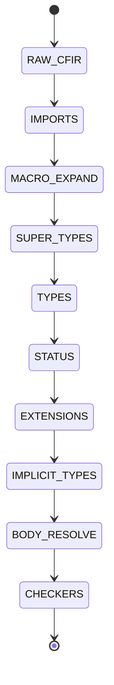

# 仓颉 Kotlin/JVM 工程架构图

生成依据：

- `settings.gradle.kts`：当前主构建包含 99 个 Gradle 模块。
- `README.md`、`CLAUDE.md`：项目定位、模块结构、仓库边界。
- `docs/cjfir-compiler-stages.md`：编译阶段与 CFIR Resolve Phase。
- `http://localhost:3000/`：当前服务返回“ChatGPT 号池管理”页面，未暴露架构图或 Mermaid 生成入口；本图不把该页面内容作为项目架构事实来源。

## 主工程模块架构

```mermaid
flowchart TB
    CJ["仓颉源码 (.cj)"]
    CJO[".cjo 编译产物"]
    LLVM["LLVM IR / 目标产物"]
    IDE["intellij-ide/ 独立构建插件"]
    DevEco["deveco/ 独立构建插件"]

    subgraph Infra["基础设施与公共抽象"]
        Util[":util"]
        Common[":common"]
        Diagnostics[":common:diagnostics"]
        Generators[":generators"]
        IntellijCore[":dependencies:intellij-core"]
        Flatbuffers[":flatbuffers-gen"]
        ResolutionCommon[":resolution.common"]
    end

    subgraph CompilerDriver["编译器驱动"]
        Config[":compiler:config"]
        Phaser[":compiler:phaser"]
        Arguments[":compiler:arguments<br/>:compiler:frontend-arguments-generator"]
        Frontend[":compiler:frontend"]
        Plugin[":compiler:plugin"]
    end

    subgraph ParseLayer["解析层"]
        PSI[":psi<br/>Lexer / Parser / PSI / LightTree 输入"]
    end

    subgraph MacroLayer["宏展开"]
        MacroCommon[":macro:macro-common<br/>接口 / 数据模型 / FlatBuffers 协议"]
        MacroProcess[":macro:macro-process<br/>外部进程执行器"]
        MacroStub[":macro:macro-stub<br/>测试与 IDE 桩"]
    end

    subgraph CfirModel["CFIR 数据模型"]
        CfirCommon[":cfir:cfir-common<br/>Session / ModuleData / Element"]
        CfirCones[":cfir:cfir-cones<br/>Cone 类型系统"]
        CfirTree[":cfir:cfir-tree<br/>声明 / 表达式 / 类型引用 / Visitor"]
        CfirTreeGen[":cfir:cfir-tree:tree-generator"]
        CfirProviders[":cfir:providers"]
        CfirSemantics[":cfir:semantics"]
        CfirSerialization[":cfir:cfir-serialization"]
    end

    subgraph RawCfir["Raw CFIR 构建"]
        RawCommon[":cfir:raw-cfir:raw-cfir-common"]
        Psi2Cfir[":cfir:raw-cfir:psi2cfir"]
        LightTree2Cfir[":cfir:raw-cfir:light-tree2cfir"]
    end

    subgraph CfirResolve["CFIR 语义解析与诊断"]
        Resolve[":cfir:resolve<br/>多 Phase 语义解析"]
        Checkers[":cfir:checkers<br/>诊断检查器"]
        CheckerGen[":cfir:checkers:checkers-component-generator"]
        Renderers[":cfir:diagnostic-renderers"]
        EntryPoint[":cfir:entrypoint<br/>Session 工厂 / Pipeline 配置"]
        CfirTests[":cfir:analysis-tests"]
    end

    subgraph AnalysisLayer["Analysis API 与低层 API"]
        AnalysisApi[":analysis:analysis-api"]
        PlatformInterface[":analysis:analysis-api-platform-interface"]
        ImplBase[":analysis:analysis-api-impl-base"]
        Standalone[":analysis:analysis-api-standalone"]
        LowLevelCfir[":analysis:low-level-api-cfir"]
        AnalysisCfir[":analysis:analysis-api-cfir"]
        AnalysisCfirGen[":analysis:analysis-api-cfir:analysis-api-cfir-generator"]
        References[":analysis:cj-references"]
        Stubs[":analysis:stubs"]
        Decompiled[":analysis:decompiled<br/>file-stubs / stubs / psi / light declarations"]
        LightDeclarations[":analysis:light-declarations"]
        SymbolLightDeclarations[":analysis:symbol-light-declarations"]
        AnalysisTools[":analysis:analysis-tools"]
        AnalysisTestFramework[":analysis:analysis-test-framework"]
    end

    subgraph EditorServices["编辑器能力与语言服务"]
        CodeInsightApi[":code-insight:api"]
        Formatting[":code-insight:formatting"]
        Folding[":code-insight:folding"]
        Highlighting[":code-insight:highlighting"]
        Refactoring[":code-insight:refactoring"]
        Fixes[":code-insight:fixes-k2"]
        OverrideImplement[":code-insight:override-implement-k2"]
        Lsp[":lsp"]
    end

    subgraph Backend["可选后端"]
        Chir[":compiler:chir"]
        Codegen[":compiler:codegen<br/>CHIR -> LLVM IR"]
        JvmCodegen[":compiler:jvm-codegen"]
        LlvmApi[":llvm-interop:llvm-interop-api"]
        LlvmJni[":llvm-interop:llvm-interop-jni"]
    end

    subgraph Publication["发布与 IDE 打包门面"]
        PrepareFrontend[":prepare:frontend<br/>:prepare:frontend-embeddable"]
        PrepareTests[":prepare:test-infrastructure<br/>:prepare:analysis-test-framework"]
        PrepareIdeFat[":prepare:ide-plugin-dependencies:*<br/>按 common / psi / code-insight / cfir / analysis 分组的 fat jar"]
        PrepareIdeModules[":prepare:ide-plugin-dependencies-module:*<br/>对应 module 形态产物"]
    end

    subgraph Tests["测试基础设施"]
        TestsRoot[":tests"]
        TestInfra[":tests:test-infrastructure"]
    end

    CJ --> PSI
    PSI --> Psi2Cfir
    PSI --> LightTree2Cfir

    Util --> Common
    Common --> Diagnostics
    PSI --> Diagnostics
    Common --> ResolutionCommon
    Flatbuffers --> MacroCommon
    Flatbuffers --> CfirSerialization
    IntellijCore -. "compileOnly" .-> PSI
    IntellijCore -. "compileOnly" .-> AnalysisApi
    IntellijCore -. "compileOnly" .-> CodeInsightApi
    IntellijCore -. "compileOnly" .-> Lsp

    Config --> Phaser
    Arguments --> Frontend
    Phaser --> Frontend
    Config --> Frontend
    Plugin --> Frontend
    Frontend --> EntryPoint
    Frontend --> MacroCommon

    MacroCommon --> MacroProcess
    MacroCommon --> MacroStub
    MacroCommon --> CfirTree
    MacroCommon --> PSI

    CfirCommon --> CfirCones
    CfirCommon --> CfirTree
    CfirCones --> CfirTree
    Generators --> CfirTreeGen
    CfirTreeGen --> CfirTree
    CfirTree --> CfirProviders
    CfirProviders --> CfirSemantics
    CfirTree --> CfirSerialization

    RawCommon --> Psi2Cfir
    RawCommon --> LightTree2Cfir
    CfirTree --> RawCommon
    CfirProviders --> RawCommon
    Psi2Cfir --> EntryPoint
    LightTree2Cfir --> EntryPoint

    EntryPoint --> Resolve
    Resolve --> Checkers
    Checkers --> Renderers
    CheckerGen --> Checkers
    CfirSerialization --> EntryPoint
    EntryPoint --> CJO
    EntryPoint --> CfirTests

    AnalysisApi --> ImplBase
    PlatformInterface --> ImplBase
    ImplBase --> Standalone
    EntryPoint --> LowLevelCfir
    LowLevelCfir --> AnalysisCfir
    CfirTree --> AnalysisCfir
    Resolve --> AnalysisCfir
    Checkers --> AnalysisCfir
    Decompiled --> AnalysisCfir
    Stubs --> AnalysisCfir
    References --> AnalysisCfir
    SymbolLightDeclarations --> AnalysisCfir
    AnalysisCfirGen --> AnalysisCfir
    AnalysisApi --> CodeInsightApi

    AnalysisCfir --> Formatting
    AnalysisCfir --> Folding
    AnalysisCfir --> Highlighting
    AnalysisCfir --> Refactoring
    AnalysisCfir --> Fixes
    AnalysisCfir --> OverrideImplement
    Formatting --> Lsp
    Folding --> Lsp
    Highlighting --> Lsp
    Refactoring --> Lsp
    AnalysisCfir --> Lsp

    CfirTree --> Chir
    Chir --> Codegen
    Chir --> JvmCodegen
    LlvmApi --> LlvmJni
    LlvmApi --> Codegen
    LlvmJni --> Codegen
    Codegen --> LLVM
    JvmCodegen --> LLVM

    Frontend --> PrepareFrontend
    EntryPoint --> PrepareIdeFat
    AnalysisCfir --> PrepareIdeFat
    CodeInsightApi --> PrepareIdeFat
    PrepareIdeFat --> IDE
    PrepareIdeModules --> IDE
    PrepareIdeFat --> DevEco
    PrepareTests --> AnalysisTestFramework

    TestInfra --> CfirTests
    TestInfra --> AnalysisTestFramework
    TestsRoot --> TestInfra
```

## 编译与分析管线

```mermaid
flowchart LR
    S["源码 .cj"]
    P1["LOAD_PLUGINS<br/>插件加载"]
    P2["PARSE<br/>PSI / LightTree"]
    P3["CONDITION_COMPILE<br/>@When 条件裁剪"]
    P4["IMPORT_PACKAGE<br/>加载 .cjo / .cjd"]
    P5["MACRO_EXPAND<br/>宏收集 / 执行 / 替换"]
    P6["CFIR_BUILD<br/>AST_DIFF Guard + 前置脱糖 + Raw CFIR"]
    P7["CFIR_RESOLVE<br/>分阶段语义解析 + CHECKERS"]
    P8["FINALIZE<br/>语义后脱糖 + 泛型实例化 + 溢出策略"]
    P9["MANGLING<br/>符号名称修饰"]
    P10["SAVE_CJO<br/>序列化 CFIR"]
    O[".cjo"]

    S --> P1 --> P2 --> P3 --> P4 --> P5 --> P6 --> P7 --> P8 --> P9 --> P10 --> O

    P1 -. ":compiler:plugin / :compiler:frontend" .-> P5
    P2 -. ":psi" .-> P6
    P5 -. ":macro:macro-common / :macro:macro-process" .-> P6
    P6 -. ":cfir:raw-cfir:* / :cfir:cfir-tree" .-> P7
    P7 -. ":cfir:resolve / :cfir:checkers / :cfir:entrypoint" .-> P8
    P10 -. ":cfir:cfir-serialization / :flatbuffers-gen" .-> O

    O --> A1["Analysis API<br/>:analysis:*"]
    A1 --> A2["Code Insight<br/>formatting / folding / highlighting / refactoring"]
    A2 --> A3["LSP / IDE / DevEco"]

    P8 --> B1["CFIR2CHIR<br/>:compiler:chir"]
    B1 --> B2["CODEGEN<br/>:compiler:codegen / :compiler:jvm-codegen"]
    B2 --> B3["LLVM interop<br/>:llvm-interop:*"]
```

## CFIR Resolve Phase

## 主构建模块分组

| 分组       | 实际模块                                                                                                                                                                                                                                                                                                                                                                                                                                                                                                                                                                                                                                                                                                       |
|----------|------------------------------------------------------------------------------------------------------------------------------------------------------------------------------------------------------------------------------------------------------------------------------------------------------------------------------------------------------------------------------------------------------------------------------------------------------------------------------------------------------------------------------------------------------------------------------------------------------------------------------------------------------------------------------------------------------------|
| 基础设施     | `:common`、`:common:diagnostics`、`:util`、`:generators`、`:dependencies:intellij-core`、`:flatbuffers-gen`、`:resolution.common`                                                                                                                                                                                                                                                                                                                                                                                                                                                                                                                                                                                |
| 编译器驱动    | `:compiler`、`:compiler:config`、`:compiler:phaser`、`:compiler:arguments`、`:compiler:frontend-arguments-generator`、`:compiler:frontend`、`:compiler:plugin`                                                                                                                                                                                                                                                                                                                                                                                                                                                                                                                                                   |
| 解析       | `:psi`                                                                                                                                                                                                                                                                                                                                                                                                                                                                                                                                                                                                                                                                                                     |
| CFIR     | `:cfir`、`:cfir:cfir-common`、`:cfir:cfir-cones`、`:cfir:cfir-tree`、`:cfir:cfir-tree:tree-generator`、`:cfir:semantics`、`:cfir:providers`、`:cfir:resolve`、`:cfir:checkers`、`:cfir:checkers:checkers-component-generator`、`:cfir:diagnostic-renderers`、`:cfir:cfir-serialization`、`:cfir:entrypoint`、`:cfir:analysis-tests`                                                                                                                                                                                                                                                                                                                                                                                     |
| Raw CFIR | `:cfir:raw-cfir`、`:cfir:raw-cfir:raw-cfir-common`、`:cfir:raw-cfir:psi2cfir`、`:cfir:raw-cfir:light-tree2cfir`                                                                                                                                                                                                                                                                                                                                                                                                                                                                                                                                                                                               |
| Analysis | `:analysis:analysis-api`、`:analysis:analysis-api-platform-interface`、`:analysis:analysis-api-impl-base`、`:analysis:analysis-api-standalone`、`:analysis:analysis-api-cfir`、`:analysis:analysis-api-cfir:analysis-api-cfir-generator`、`:analysis:low-level-api-cfir`、`:analysis:analysis-internal-utils`、`:analysis:cj-references`、`:analysis:stubs`、`:analysis:decompiled`、`:analysis:decompiled:decompiler-to-file-stubs`、`:analysis:decompiled:decompiler-to-stubs`、`:analysis:decompiled:decompiler-to-psi`、`:analysis:decompiled:light-declarations-for-decompiled`、`:analysis:light-declarations`、`:analysis:symbol-light-declarations`、`:analysis:analysis-tools`、`:analysis:analysis-test-framework` |
| 编辑器与语言服务 | `:code-insight`、`:code-insight:api`、`:code-insight:fixes-k2`、`:code-insight:formatting`、`:code-insight:folding`、`:code-insight:highlighting`、`:code-insight:override-implement-k2`、`:code-insight:refactoring`、`:lsp`                                                                                                                                                                                                                                                                                                                                                                                                                                                                                      |
| 宏展开      | `:macro:macro-common`、`:macro:macro-process`、`:macro:macro-stub`                                                                                                                                                                                                                                                                                                                                                                                                                                                                                                                                                                                                                                           |
| 后端       | `:compiler:chir`、`:compiler:codegen`、`:compiler:jvm-codegen`、`:llvm-interop`、`:llvm-interop:llvm-interop-api`、`:llvm-interop:llvm-interop-jni`                                                                                                                                                                                                                                                                                                                                                                                                                                                                                                                                                             |
| 测试       | `:tests`、`:tests:test-infrastructure`                                                                                                                                                                                                                                                                                                                                                                                                                                                                                                                                                                                                                                                                      |
| 发布门面     | `:prepare:frontend`、`:prepare:frontend-embeddable`、`:prepare:test-infrastructure`、`:prepare:analysis-test-framework`、`:prepare:ide-plugin-dependencies:*`、`:prepare:ide-plugin-dependencies-module:*`                                                                                                                                                                                                                                                                                                                                                                                                                                                                                                      |
