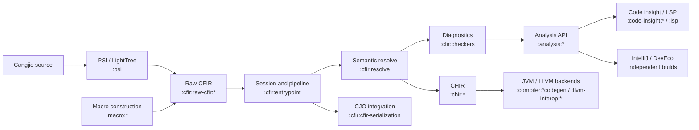

# Cangjie architecture

[中文](project-architecture-diagram.zh-CN.md) | [Frontend stages](cjfir-compiler-stages.md) | [Module catalog](module-catalog.md)

This view describes the current first-party subsystem boundaries. `settings.gradle.kts` defines the included modules; the module catalog provides the complete inventory.

## Ownership

| Layer | Modules | Contract |
| --- | --- | --- |
| Foundation | `:common`, `:util`, `:generators`, `:resolution.common`, `:common:diagnostics` | Shared domain model, utilities, generation, inference, and diagnostics foundation |
| Compiler and syntax | `:compiler:*`, `:psi` | Compiler configuration, phase framework, source input, lexer, parser, and PSI |
| CFIR | `:cfir:*` | Frontend IR, construction, semantics, diagnostics, serialization, and tests |
| Analysis and language service | `:analysis:*`, `:code-insight:*`, `:lsp` | Analysis contracts/implementations and editor-facing services |
| Macro and backend | `:macro:*`, `:chir:*`, `:compiler:*codegen`, `:llvm-interop:*` | Macro execution plus optional backend transformation and code generation |
| Publication | `:prepare:*` | Public Maven artifacts and IDE dependency packaging |

## Independent builds

`intellij-ide/` and `deveco/` are separate builds. They consume the main frontend through their documented integration boundaries and are not included by the root `settings.gradle.kts`.

## Invariants

- Independent capabilities expose stable interfaces and do not leak implementation details across module boundaries.
- `CfirResolvePhase` covers ordinary declaration resolution through `BODY_RESOLVE`; macro construction and the diagnostics pipeline have separate boundaries.
- Current module membership is derived from `settings.gradle.kts`, not from planning documents or historical module names.
