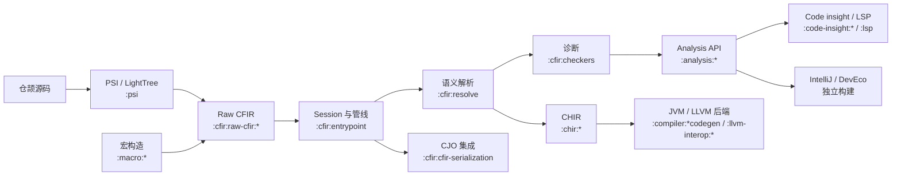

# Cangjie 工程架构

[English](project-architecture-diagram.md) | [前端阶段](cjfir-compiler-stages.zh-CN.md) | [模块目录](module-catalog.md)

本图描述当前一方子系统边界。`settings.gradle.kts` 定义被包含的模块，完整清单见模块目录。

## 分层归属

| 层次 | 模块 | 契约 |
| --- | --- | --- |
| 基础设施 | `:common`、`:util`、`:generators`、`:resolution.common`、`:common:diagnostics` | 公共领域模型、工具、生成、推断与诊断基础 |
| 编译器与语法 | `:compiler:*`、`:psi` | 编译器配置、阶段框架、源码输入、Lexer、Parser 与 PSI |
| CFIR | `:cfir:*` | 前端 IR、构建、语义、诊断、序列化与测试 |
| Analysis 与语言服务 | `:analysis:*`、`:code-insight:*`、`:lsp` | Analysis 契约/实现和面向编辑器的服务 |
| 宏与后端 | `:macro:*`、`:chir:*`、`:compiler:*codegen`、`:llvm-interop:*` | 宏执行及可选后端转换、代码生成 |
| 发布 | `:prepare:*` | 公共 Maven 工件与 IDE 依赖打包 |

## 独立构建

`intellij-ide/` 与 `deveco/` 是独立构建；它们通过各自文档规定的集成边界消费主前端，不在根 `settings.gradle.kts` 中。

## 不变量

- 独立能力通过稳定接口暴露，不跨模块泄漏实现细节。
- `CfirResolvePhase` 仅覆盖至 `BODY_RESOLVE` 的普通声明解析；宏构造与诊断管线具有独立边界。
- 当前模块成员由 `settings.gradle.kts` 推导，不依赖规划文档或历史模块名。
